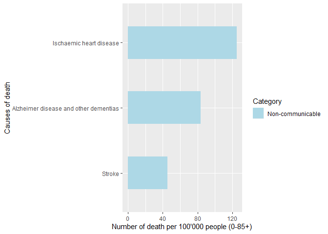
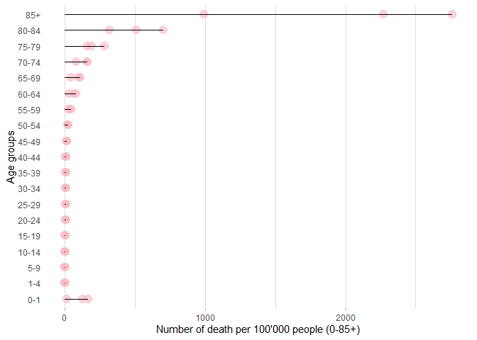
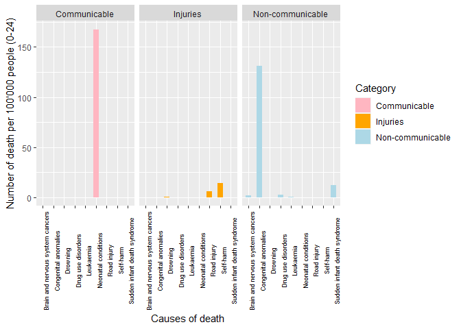
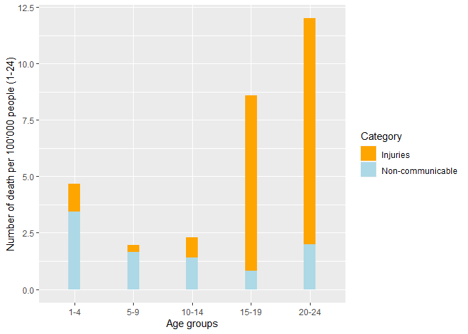
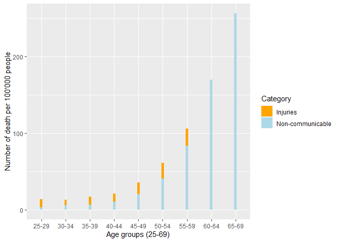

Causes of death by age in Switzerland
================
Rachel Ferati
2022-12-14

-   <a href="#introduction" id="toc-introduction">Introduction</a>
    -   <a href="#research-question" id="toc-research-question">Research
        question</a>
    -   <a href="#hypothesis" id="toc-hypothesis">Hypothesis</a>
    -   <a href="#predictions-and-definition"
        id="toc-predictions-and-definition">Predictions and definition</a>
    -   <a href="#dataset" id="toc-dataset">Dataset</a>
-   <a href="#the-three-main-causes-of-death-in-switzerland-in-2019"
    id="toc-the-three-main-causes-of-death-in-switzerland-in-2019">The three
    main causes of death in Switzerland in 2019</a>
    -   <a href="#statistical-tests" id="toc-statistical-tests">Statistical
        tests</a>
-   <a
    href="#causes-of-deaths-among-children-and-young-adults-0-24-years-old"
    id="toc-causes-of-deaths-among-children-and-young-adults-0-24-years-old">Causes
    of deaths among children and young-adults (0-24 years-old)</a>
    -   <a
        href="#causes-of-deaths-among-children-and-young-adults-1-24-years-old"
        id="toc-causes-of-deaths-among-children-and-young-adults-1-24-years-old">Causes
        of deaths among children and young-adults (1-24 years-old)</a>
-   <a href="#causes-of-deaths-among-adults-25-85-years-old"
    id="toc-causes-of-deaths-among-adults-25-85-years-old">Causes of deaths
    among adults (25-85+ years-old)</a>
-   <a href="#conclusion" id="toc-conclusion">Conclusion</a>
-   <a href="#references" id="toc-references">References</a>

This report uses the R programming language and the following R
libraries :

``` r
library(tidyverse)
library(knitr)
library(ggplot2)
library(dplyr)
library(treemap)
library(hrbrthemes)
```


# Introduction

*How Am I going to die* ? We all one day ask ourselves this question.
And, of course, this question is often followed by *When Am I going to
die ?* Although these questions cannot be answered, it is important to
identify the number of deaths and their causes to have a better
understanding of the situation in a country.

> > > An important input to national and international health
> > > decision-making and planning processes is a consistent and
> > > comparative analysis of the causes of death across different
> > > population groups (Mathers, C.B. et al, 2009)

Indeed, the causes of death differ from one country to another, and also
from one person to another. It depends on many factors, i.e., the
social-economic environment, the age, the family, etc. It is important
for a family to know which disease occurs within the family, and it is
important for a country to know which are the causes of death of the
population. To know that, there are a lot of database that exist for
many countries. The one from which we extracted the data needed for our
essay comes from the [World Health
Organization](@https://www.who.int/data/gho/data/themes/mortality-and-global-health-estimates/ghe-leading-causes-of-death).

> > > Over the last decade, the WHO has intensified efforts to support
> > > the collection of vital registration information and other
> > > mortality data in developing countries (Mathers, C.B. et al,2009)

## Research question

In this essay, we will be interested in the differences between the
three leading causes of death across ages, and more precisely between
children and adults. We will less focused on the number of death in
itself, since it is not surprising that more people died when they get
older, but rather on the type of causes, whether it is communicable,
meaning that it is transmitted to one another (genetic illnesses),
non-communicable, and injuries, meaning the causes that comes from the
external world (car accident), or from ourselves (self-harm). Our data
set will concern only Switzerland’s population in 2019. The difference
between this country and the others, for example those who are not
considered as WEIRD[^1] countries, as well as the difference between
2019 and other years, could be the subject of another scientific report.

Our research question is the following : **Is there a difference in the
type of deaths between children and adults ?**

## Hypothesis

-   H0 : there is no differences in the type of death between children
    and adults in Switzerland in 2019

-   H1 : There is a differences in the type of death between children
    and adults in Switzerland in 2019

## Predictions and definition

Our prediction is that young-adults and adults die mostly from injuries,
compared to children, who die mostly from non-communicable and
communicable diseases.

**Children**  
Between 0 and 14 years-old

**Young-adults**  
Between 15 and 24 years-old

**Adults**  
Between 25 and 85+ years-old

## Dataset

The dataset for this scientific report comes from the following file :

``` r
library(readxl)
Deathstat <- read_excel("~/UNINE/UniNE/Master en Sciences cognitives/Data science/Data - Scientific report/Final Scientific report/Deathstat.xlsx")
```

Here is a view of the variables used in this scientific report :

``` r
Deathstat$Category <- as.factor(Deathstat$Category)
Deathstat$Rank <- as.factor(Deathstat$Rank)

str(Deathstat)
```

    ## tibble [60 × 8] (S3: tbl_df/tbl/data.frame)
    ##  $ Continent: chr [1:60] "Europe" "Europe" "Europe" "Europe" ...
    ##  $ Country  : chr [1:60] "Switzerland" "Switzerland" "Switzerland" "Switzerland" ...
    ##  $ Year     : num [1:60] 2019 2019 2019 2019 2019 ...
    ##  $ Age      : chr [1:60] "0-85+" "0-85+" "0-85+" "0-1" ...
    ##  $ Rank     : Factor w/ 3 levels "1","2","3": 1 2 3 1 2 3 1 2 3 1 ...
    ##  $ Cause    : chr [1:60] "Ischaemic heart disease" "Alzheimer disease and other dementias" "Stroke" "Neonatal conditions" ...
    ##  $ Nb       : num [1:60] 124.7 83.7 45.6 167.6 127 ...
    ##  $ Category : Factor w/ 3 levels "Communicable",..: 3 3 3 1 3 3 3 2 2 3 ...

# The three main causes of death in Switzerland in 2019

The WHO database, in addition to having identified the different causes
of death by age category, has also made a summary of the three main
causes of death, all ages combined (0-85+ years-old).

In this graph, we can have an overview of the three main causes of death
among all ages in Switzerland in 2019 :

``` r
DeathAll <-Deathstat[1:3,]

ggplot(DeathAll, aes(x=fct_reorder(Cause, Nb), y=Nb, fill=Category,width = 0.5)) +
  geom_bar(stat = "identity") +
  xlab("Causes of death") + 
  ylab("Number of death per 100'000 people (0-85+)") +
  coord_flip() +
  scale_fill_manual(values = c("Lightblue"))
```

<!-- -->

We can see that the three most common death for all groups are ischaemic
heart disease (cause n°1), Alzheimer disease and other dementia (cause
n°2), and stroke (cause n°3). All of these causes are considered
“non-communicable”.

What is this telling us ? By seeing this graph, we could think that
there is only one category of death in Switzerland in 2019, which is
“non-communicable”. To have a better view of the results, we have to
take a look at the number of death per 100’000 people between ages :

``` r
DeathADCH <- Deathstat[4:60,]

ggplot(DeathADCH, aes(x=fct_relevel(Age, c("5-9"), after = 2), y=Nb)) +
  geom_point(color="Lightpink", size=4, alpha=0.6) + 
  geom_segment(aes(x=Age, xend=Age, y=0, yend=Nb)) +
  theme_light() +
  coord_flip() +
  xlab("Age groups") +
  ylab("Number of death per 100'000 people (0-85+)") +
  theme(
    panel.grid.major.y = element_blank(),
    panel.border = element_blank(),
    axis.ticks.y = element_blank())
```

<!-- -->

What we can see is that the number of death per 100’000 people is quite
high for children between 0 and 1 years-old, compared to people between
1 and 49 years-old. Then, the number increases from 50 years-old and
reach the highest for the 85 years-old and more.

That explains why the three main causes of death across all ages in
Switzerland in 2019 is composed only of non-communicable diseases. This
is because there is a significant difference between the number of death
of the 50 and 85+ years-old adults compared to the rest of the
population.

### Statistical tests

To have a better understanding of this phenomenon, we run an ANOVA test
to see if the effect of age on the number of death is significant :

``` r
TestLM <- lm(Nb~Age, data = DeathADCH)
summary(TestLM)
```

    ## 
    ## Call:
    ## lm(formula = Nb ~ Age, data = DeathADCH)
    ## 
    ## Residuals:
    ##      Min       1Q   Median       3Q      Max 
    ## -1017.70    -2.05    -0.14     4.13   754.04 
    ## 
    ## Coefficients:
    ##             Estimate Std. Error t value Pr(>|t|)    
    ## (Intercept)   102.22     124.87   0.819   0.4181    
    ## Age1-4       -100.67     176.59  -0.570   0.5720    
    ## Age10-14     -101.46     176.59  -0.575   0.5690    
    ## Age15-19      -99.36     176.59  -0.563   0.5770    
    ## Age20-24      -98.22     176.59  -0.556   0.5813    
    ## Age25-29      -97.73     176.59  -0.553   0.5832    
    ## Age30-34      -98.01     176.59  -0.555   0.5821    
    ## Age35-39      -96.73     176.59  -0.548   0.5870    
    ## Age40-44      -95.21     176.59  -0.539   0.5929    
    ## Age45-49      -90.52     176.59  -0.513   0.6112    
    ## Age5-9       -101.57     176.59  -0.575   0.5685    
    ## Age50-54      -82.03     176.59  -0.465   0.6449    
    ## Age55-59      -67.09     176.59  -0.380   0.7061    
    ## Age60-64      -45.76     176.59  -0.259   0.7969    
    ## Age65-69      -16.82     176.59  -0.095   0.9246    
    ## Age70-74       30.52     176.59   0.173   0.8637    
    ## Age75-79      109.09     176.59   0.618   0.5404    
    ## Age80-84      405.04     176.59   2.294   0.0274 *  
    ## Age85+       1903.87     176.59  10.781 4.05e-13 ***
    ## ---
    ## Signif. codes:  0 '***' 0.001 '**' 0.01 '*' 0.05 '.' 0.1 ' ' 1
    ## 
    ## Residual standard error: 216.3 on 38 degrees of freedom
    ## Multiple R-squared:  0.866,  Adjusted R-squared:  0.8025 
    ## F-statistic: 13.64 on 18 and 38 DF,  p-value: 1.953e-11

``` r
anova(TestLM)
```

    ## Analysis of Variance Table
    ## 
    ## Response: Nb
    ##           Df   Sum Sq Mean Sq F value    Pr(>F)    
    ## Age       18 11484125  638007   13.64 1.953e-11 ***
    ## Residuals 38  1777460   46775                      
    ## ---
    ## Signif. codes:  0 '***' 0.001 '**' 0.01 '*' 0.05 '.' 0.1 ' ' 1

The results show that the effect of age on the number of death is
significant (F-statistic = 13.64, df = 18, 38), p-value \<.001).

# Causes of deaths among children and young-adults (0-24 years-old)

To have a better view on the subject and to see if our hypothesis is
supported or not, we will now have a look at the three main causes of
death among children and young adults.

Here is a graph that presents the type of death that can be find among
children and young-adults between 0 and 24 years-old.

This graph seems to confirm that children die mostly from communicable
and non-communicable diseases.

``` r
DeathInfant <-Deathstat[4:21,]

ggplot(DeathInfant, aes(x=Cause, y=Nb, fill=Category, width = 0.5)) +
  geom_bar(stat = "identity") +
  xlab("Causes of death") + 
  ylab("Number of death per 100'000 people (0-24)") +
  facet_wrap(~ Category) +
  theme(axis.text.x = element_text(color="Black", 
                           size=7, angle=90)) +
  scale_fill_manual(values = c("Lightpink", "Orange", "Lightblue"))
```

<!-- -->

However, as we saw in the previous graph, there are more deaths between
0 and 1 years-old, compared to children and young-adults between 1 and
24 years-old.

To see if our hypothesis is supported, we have to look more precisely
the causes of death between 1 and 24 years-old.

## Causes of deaths among children and young-adults (1-24 years-old)

``` r
DeathChild <- Deathstat[7:21,]

ggplot(DeathChild, aes(x=fct_relevel(Age, c("5-9"), after = 1), y=Nb, fill=Category, width=c(0.2))) +
  geom_bar(stat = "identity") +
  xlab("Age groups") + 
  ylab("Number of death per 100'000 people (1-24)") +
  scale_fill_manual(values = c("Orange", "Lightblue"))
```

<!-- -->

What we see in this graph confirms our hypothesis that there is a
difference in the type of death between children and adults. To be more
precise, it seems that children between 0 and 14 years-old die mostly
from non-communicable diseases. What we can also see is that from the
age of 15 years-old, the first cause of death is injuries (Self-harm).

This follows our prediction that children (0-14 years-old) die mostly
from communicable and non-communicable disease, and young-adults die
mostly from injuries. To see if our hypothesis is confirmed, we also
have to see the difference with the causes of death among adults.

# Causes of deaths among adults (25-85+ years-old)

As we saw earlier, there is an increase in the number of death between
70 ans 85+ years-old. We also saw that the main type of death for older
people is “non-communicable”. To see in more details the causes of death
among adults, we decided to take only the data for adults between 25 and
69 years-old.

``` r
DeathAdult2 <- Deathstat[22:48,]

ggplot(DeathAdult2, aes(x=Age, y=Nb, fill=Category, width=c(0.1))) +
  geom_bar(stat = "identity") +
  xlab("Age groups (25-69)") + 
  ylab("Number of death per 100'000 people") +
  scale_fill_manual(values = c("Orange", "Lightblue"))
```

<!-- -->

What this graph tell us is that the main type of death among adults
between 25 and 44 years-old is injuries, compared to adult between 50
and 60 years-old.

This confirmed our hypothesis that there is a difference in the type of
death between children (non-communicable) and adults (injuries).

# Conclusion

We saw in this short study that children between 0 and 14 years-old die
mostly from communicable and non-communicable diseases, young-adults and
adults between 14 and 49 die mostly from injuries, and that adults
between 50 and 85+ years-old die mostly from non-communicable diseases.

Our hypothesis is therefore confirmed, that there is a difference
between types of death between children and adults. However, our
predictions could have been more precise. Indeed, we saw in the graphs
that adults from 50 and 85+ years-old die mostly from non-communicable
diseases, compare to adults between 25 and 49 years-old.

Finally, it could be interesting, for future studies, to be interested
at the differences between Switzerland and other countries.

# References

Mathers, C. D., Boerma, T., & Ma Fat, D. (2009). Global and regional
causes of death. British medical bulletin, 92(1), 7-32.

R Core Team. 2021. R: A Language and Environment for Statistical
Computing. Vienna, Austria: R Foundation for Statistical Computing.
<https://www.R-project.org/>.

World Health Organization, find in :
<https://www.who.int/data/gho/data/themes/mortality-and-global-health-estimates/ghe-leading-causes-of-death>)

[^1]: Western, educated, industrialized, rich and democratic
